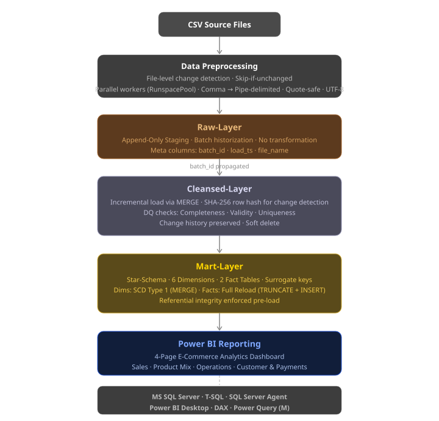
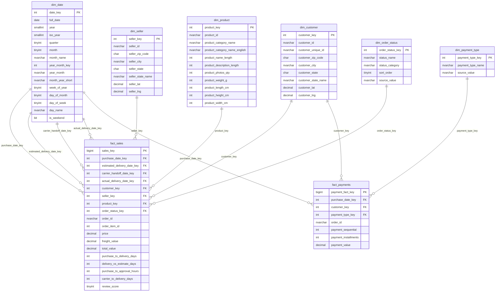
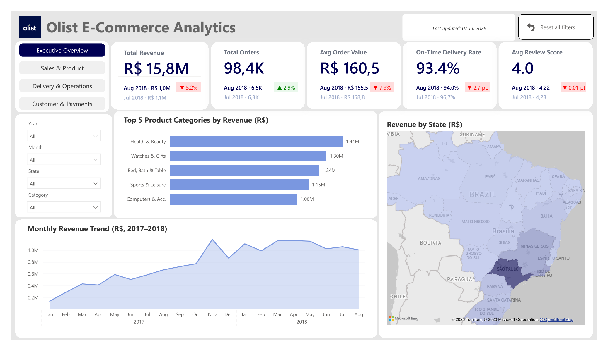
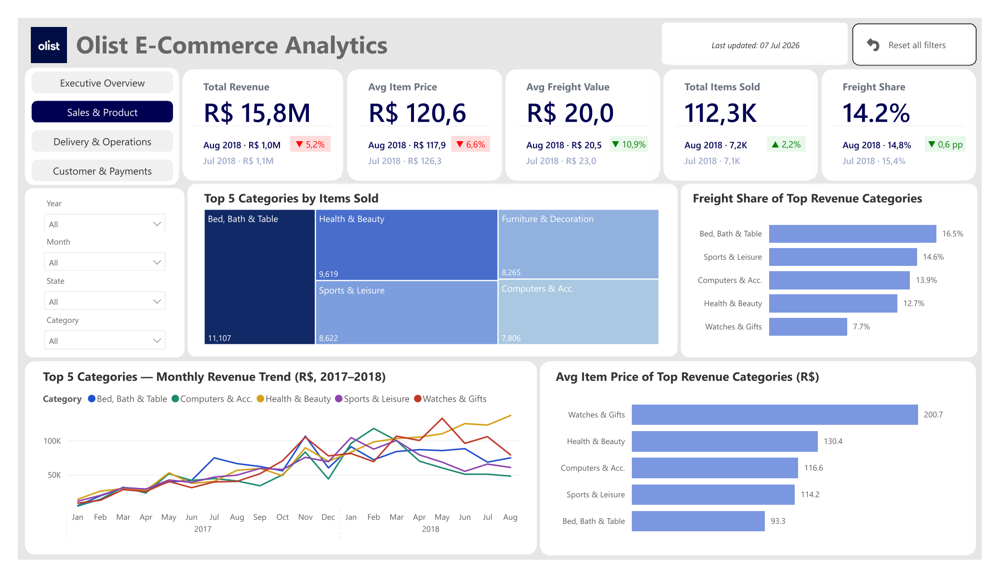
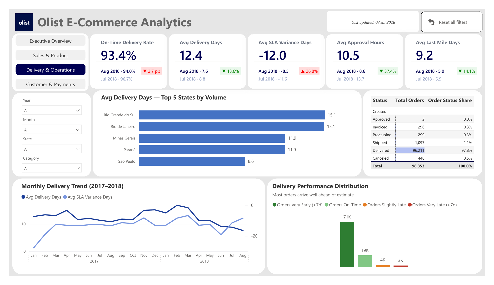
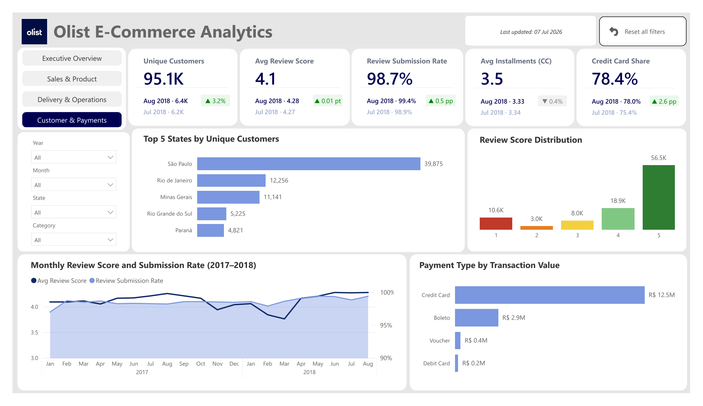

# Olist E-Commerce Analytics Platform

SQL Server Data Warehouse und Power BI Dashboard auf Basis des öffentlichen [Olist Brazilian E-Commerce Datensatzes](https://www.kaggle.com/datasets/olistbr/brazilian-ecommerce): anonymisierte Echtdaten mit rund 100.000 Bestellungen aus der frühen Wachstumsphase (2016–2018).

Olist ist eine brasilianische SaaS-Plattform, die kleinen und mittelständischen Unternehmen die gleichzeitige Listung ihrer Produkte auf über 13 Marktplätzen (u.a. Mercado Livre, Amazon BR und B2W) ermöglicht. Das Unternehmen wurde 2021 mit 1,5 Mrd. USD bewertet und zählt damit zu den größten brasilianischen E-Commerce-Startups.

Ziel des Projekts ist der Aufbau einer produktionsnahen Analytics Platform auf Basis eines SQL Server Data Warehouse, von der Quelldatenaufnahme über mehrstufige Transformation und Modellierung bis zum analytischen Reporting. Implementiert werden etablierte DWH-Patterns: Metadata-Driven Orchestrierung, Batch-Historisierung, inkrementelles Ladekonzept mit SHA-256 Change Detection, Datenqualitätsprüfung, Soft Delete und transaktionssichere Stored Procedures. Als Reporting-Layer rundet ein 4-seitiges Power BI Dashboard auf dem Star-Schema im Mart die Architektur ab.

---

## Architektur



Die Architektur folgt einem dreischichtigen ELT-Ansatz: `raw`, `cleansed` und `mart`. Der `raw`-Layer nimmt die Quelldaten unverändert als append-only Abbild auf. Der `cleansed`-Layer bereinigt, validiert und erkennt Änderungen inkrementell per SHA2-256 Row-Hash. Der `mart`-Layer baut daraus ein Kimball Star Schema auf, das direkt als Datenquelle für das Power BI Dashboard dient. Querschnittsschemas (`audit`, `orchestration`) stellen Rückverfolgbarkeit und Metadata-Driven Steuerung aller Pipelines sicher.

---

## Datenbasis

**Quelle:** [Olist Brazilian E-Commerce](https://www.kaggle.com/datasets/olistbr/brazilian-ecommerce)

| Datei                                   | Inhalt                             |
| --------------------------------------- | ----------------------------------- |
| `olist_customers_dataset.csv`           | Kundenstammdaten                   |
| `olist_orders_dataset.csv`              | Bestellkopfdaten                   |
| `olist_order_items_dataset.csv`         | Bestellpositionen                  |
| `olist_order_payments_dataset.csv`      | Zahlungsinformationen              |
| `olist_order_reviews_dataset.csv`       | Kundenbewertungen                  |
| `olist_products_dataset.csv`            | Produktstammdaten                  |
| `olist_sellers_dataset.csv`             | Verkäuferstammdaten                |
| `olist_geolocation_dataset.csv`         | PLZ-Geodaten                       |
| `product_category_name_translation.csv` | Kategorie-Übersetzungen (PT → EN)  |

---

## Data Mart: Star-Schema

Der Mart-Layer bildet das auswertungsbereite Datenmodell: ein Kimball Star Schema mit 6 Dimensionen und 2 Faktentabellen, das direkt als Datenquelle für das Power BI Dashboard dient.




`fact_sales` speichert jede Bestellposition auf Ebene Datum, Kunde, Verkäufer, Produkt und Bestellstatus, mit Preis, Frachtkosten und Lieferzeitkennzahlen als zentrale Measures. `fact_payments` erfasst jede Zahltransaktion auf Ebene Datum, Kunde und Zahlungsart, mit Zahlungsbetrag und Ratenanzahl. Alle sechs Dimensionen kurz erläutert:

- `dim_date`: Kalenderdimension (Jahr, Quartal, Monat, Woche, Tag inkl. Wochenend-Flag), Basis für Zeitraumvergleiche und Trendanalysen.
- `dim_customer`: Kundenstamm mit Stadt, Bundesstaat und Koordinaten, Basis für geografische Auswertungen nach Kundenstandort.
- `dim_seller`: Verkäuferstamm mit Stadt, Bundesstaat und Koordinaten, analog zu `dim_customer` für Verkäuferstandorte.
- `dim_product`: Produktstamm mit Kategorie (Portugiesisch und Englisch) sowie physischen Maßen (Gewicht, Abmessungen).
- `dim_order_status`: Bestellstatusausprägungen mit Kategorie und Sortierreihenfolge, Basis für die Statusverteilungsanalyse.
- `dim_payment_type`: Zahlungsarten (Kreditkarte, Boleto, Voucher, Debitkarte), Basis für die Zahlungsstrukturanalyse.

---

## Data Warehouse Pipeline-Design

Die Pipeline ist auf drei Kernziele ausgelegt: **Robustheit** (transaktionssicheres Laden ohne Datenverlust), **Rückverfolgbarkeit** (vollständiger Audit-Trail über alle Layer) und **Effizienz** (inkrementelles Ladekonzept, das nur geänderte Daten verarbeitet). Jeder Layer erfüllt eine klar abgegrenzte Aufgabe: von der Rohdatenaufnahme über die qualitätsgesicherte Bereinigung bis zum analytisch optimierten Star Schema.

### Querschnittsschemas

| Schema          | Inhalt                                                                                                                   |
| --------------- | ------------------------------------------------------------------------------------------------------------------------ |
| `audit`         | `load_log`, `error_log`, `dq_log`, `job_log`: vollständiger Audit-Trail jedes Ladevorgangs                              |
| `orchestration` | `pipeline_config` (Metadata Framework), `sp_run_layer`, `sp_run_full_load`, `agent_job_full_load` (SQL Server Agent Job) |

### Preprocessing: Quelldatenvorbereitung

Bevor Quelldateien in den RAW-Layer geladen werden, normalisiert `preprocess_all.ps1` Dateien mit eingebetteten Trennzeichen (z.B. Kommas in Freitextfeldern, Zeilenumbrüche in Bewertungstexten): Konvertierung von comma-delimited zu pipe-delimited. Das Preprocessing greift nur für Dateien mit `needs_preprocessing = 1` in `orchestration.pipeline_config` und wird ausschließlich ausgeführt, wenn sich die Quelldatei seit dem letzten erfolgreichen Load geändert hat (`LastWriteTimeUtc > last_success_ts`); unveränderte Dateien werden übersprungen.

### Raw: Unveränderliche Rohdatenhistorie

Der RAW-Layer dient als unveränderliches Abbild der Quelldaten. Jeder Load erhält eine eindeutige `batch_id` (GUID), die allen Zeilen des Batches zugewiesen wird. Die Tabellen wachsen append-only, jeder Ladestand ist vollständig rekonstruierbar. Non-Clustered Indexes auf `batch_id` stellen sicher, dass der `WHERE batch_id = @batch_id`-Filter in nachgelagerten SPs als Index Seek ausgeführt wird; die Cleansed-SPs lesen ausschließlich die Zeilen des aktuellen Batches aus der RAW-Tabelle, nicht die gesamte wachsende Historie.

### Cleansed: Qualitätsgesicherte, inkrementelle Bereinigung

Der CLEANSED-Layer übernimmt Bereinigung, Validierung und Änderungserkennung. Vor jedem MERGE läuft eine CTE-basierte Datenqualitätsprüfung über drei Dimensionen, deren Ergebnisse aggregiert in `audit.dq_log` geschrieben werden:

| Dimension        | Prüfungen                                                                                                                                        |
| ---------------- | ------------------------------------------------------------------------------------------------------------------------------------------------ |
| **Completeness** | NULL-Werte, leere Strings nach Bereinigung                                                                                                       |
| **Validity**     | Länge, Format (Hex-IDs, numerische Felder, Datumsformat), Wertemenge (z.B. `payment_type`), logische Konsistenz (z.B. Lieferdatum vor Kaufdatum) |
| **Uniqueness**   | Duplikate auf dem natürlichen Schlüssel innerhalb eines Batches                                                                                      |

Duplikate auf dem natürlichen Schlüssel werden in zwei Typen unterschieden: **Type A** (identischer Inhalt unter gleichem Key) wird geloggt und durch `ROW_NUMBER()` dedupliziert, löst aber keinen Abbruch aus, da es sich um eine strukturelle Eigenschaft des Quelldatensatzes handelt (z.B. mehrere Koordinatenpaare pro `zip_code_prefix`) und die Selektion deterministisch erfolgt. **Type B** (widersprüchlicher Inhalt unter gleichem Key) bricht den MERGE mit einem expliziten `THROW` ab, da eine eindeutige Auflösung nicht möglich ist.

Änderungserkennung erfolgt über einen SHA2-256-Hash aller fachlichen Spalten:

```sql
HASHBYTES('SHA2_256', CONCAT(col1, '|', col2, '|', ...)) AS row_hash
```

Der Hash wird beim Load für jede Zeile berechnet und im MERGE mit dem gespeicherten `row_hash` der Cleansed-Tabelle verglichen. Stimmen die Hashes überein, wird die Zeile übersprungen; weichen sie ab, wird ein UPDATE durchgeführt: Die fachlichen Spalten in der Cleansed-Tabelle werden mit den neuen Werten aus RAW überschrieben und der gespeicherte `row_hash` aktualisiert. Das Pipe-Trennzeichen verhindert, dass unterschiedliche Spaltenwert-Kombinationen denselben Hash erzeugen (z.B. `"AB" + "C"` vs. `"A" + "BC"` würden ohne Trennzeichen identisch konkateniert).

Zeilen, die im aktuellen Batch nicht mehr vorkommen, werden soft-deleted (`is_deleted = 1`) statt physisch entfernt. Eine physische Löschung würde FK-Referenzen aus dem Mart invalidieren und den Audit-Trail unterbrechen; durch Soft Delete bleiben Dimensionsschlüssel im Mart gültig und jeder vergangene Ladezustand bleibt rekonstruierbar. Wiederauftauchende Datensätze werden automatisch reaktiviert.

### Mart: Ladelogik und Modellierung

Das Star-Schema-Modell ist im Abschnitt [Data Mart: Star-Schema](#data-mart-star-schema) beschrieben. Im Folgenden die Ladelogik erläutert:

**Dimensionen** werden über SCD Type 1 MERGE geladen. SCD Type 1 (Slowly Changing Dimension) beschreibt eine Strategie, bei der Dimensionsattribute bei Änderung direkt überschrieben werden; im Gegensatz zu SCD Type 2 werden keine historischen Versionsstände angelegt. Für dieses Projekt ist das ausreichend, da reine Stammdaten (z.B. Kundenadressen, Produktkategorien) für analytische Zwecke keine Historisierung benötigen. `dim_date`, `dim_payment_type` und `dim_order_status` werden einmalig geseedet (INSERT WHERE NOT EXISTS).

**Faktentabellen** werden bei jedem Lauf vollständig neu geladen (TRUNCATE + INSERT), da die Quelldaten abgeschlossene Orders repräsentieren. Non-Clustered Columnstore Indexes auf beiden Faktentabellen optimieren analytische Abfragen. Nicht auflösbare FK-Referenzen werden über Sentinel-Werte (`-1` für Dimensionsschlüssel, `0` für Datumsschlüssel) abgesichert.

### Transaktionsmanagement

MERGE und SUCCESS-Update laufen innerhalb einer expliziten Transaktion und committen atomar. Status-Einträge und DQ-Log werden bewusst außerhalb der Transaktion geschrieben. Sie überleben einen Rollback und bleiben für die Fehlerdiagnose querybar.

### Metadata-Driven Orchestrierung

Alle ETL-Pipelines werden zentral über `orchestration.pipeline_config` gesteuert, einem Metadata Framework, das Konfiguration und Ausführungslogik vollständig trennt. Neue Entitäten erfordern ausschließlich einen neuen Konfigurationseintrag, ohne Änderung an der Orchestrierungslogik.

```
pipeline_config
├── sp_name               -> welche SP wird aufgerufen
├── source_pipeline_id    -> FK auf die upstream RAW-Pipeline
├── file_path / file_name -> Quelldatei
├── needs_preprocessing   -> ob preprocess_all.ps1 die Datei vorverarbeiten soll
├── load_sequence         -> Ausführungsreihenfolge innerhalb eines Layers
├── is_active             -> Pipeline ein-/ausschaltbar
└── last_run_status / last_batch_id -> Laufzeitstatus, wird nach jedem Load aktualisiert
```

`sp_run_full_load` startet einen vollständigen Lauf über alle Layer; `sp_run_layer` iteriert über alle aktiven Pipelines eines Layers in definierter Reihenfolge. Der SQL Server Agent Job automatisiert die Ausführung: Preprocessing (CmdExec) gefolgt von `sp_run_full_load` (T-SQL). Kein manueller Eingriff erforderlich.

---

## Power BI Dashboard

Das 4-seitige Dashboard deckt die zentralen analytischen Domänen der Plattform ab: Gesamtkennzahlen, Produkt- und Vertriebsanalyse, Lieferperformance sowie Kunden- und Zahlungsverhalten. Jede Seite enthält KPI-Cards mit MoM-Delta, themenspezifische Trendanalysen und einen gemeinsamen Filterbereich (Jahr, Monat, Bundesstaat, Produktkategorie).

> **Hinweis:** Der Report ist auf den Zeitraum Januar 2017 – August 2018 eingeschränkt. Sep–Dez 2016 (Ramp-up, sehr geringes Volumen) und Sep 2018 (unvollständiger Abschlussmonat) sind aus den Visualisierungen ausgeblendet. Die zugrundeliegenden Mart-Tabellen enthalten den vollen Datensatz 2016–2018.

### Seite 1: Executive Overview



### Seite 2: Sales & Product



### Seite 3: Delivery & Operations



### Seite 4: Customer & Payments



DAX Measures: [`powerbi/te_create_measures.csx`](powerbi/te_create_measures.csx)

---

## Projektstruktur

```
olist-ecommerce-dwh/
├── data/
├── docs/
│   └── images/
│       ├── architecture/
│       │   └── dwh_architecture.svg
│       └── dashboard/
│           ├── page1_executive_overview.png
│           ├── page2_sales_and_product.png
│           ├── page3_delivery_and_operations.png
│           └── page4_customer_and_payments.png
├── powerbi/
│   ├── olist_theme.json
│   └── te_create_measures.csx
├── analysis/
│   └── eda/
│       ├── eda_customers.sql
│       ├── eda_orders.sql
│       └── ...
├── scripts/
│   └── ps/
│       └── preprocess_all.ps1
├── sql/
│   ├── setup/
│   │   └── create_schemas.sql
│   ├── audit/
│   │   └── schema/
│   │       └── create_audit_tables.sql
│   ├── raw/
│   │   ├── schema/
│   │   │   └── create_raw_tables.sql
│   │   └── procedures/
│   │       ├── raw_sp_load_customers.sql
│   │       ├── raw_sp_load_orders.sql
│   │       └── ...
│   ├── cleansed/
│   │   ├── schema/
│   │   │   └── create_cleansed_tables.sql
│   │   └── procedures/
│   │       ├── cleansed_sp_load_customers.sql
│   │       ├── cleansed_sp_load_orders.sql
│   │       └── ...
│   ├── mart/
│   │   ├── schema/
│   │   │   └── create_mart_tables.sql
│   │   └── procedures/
│   │       ├── mart_sp_load_fact_sales.sql
│   │       ├── mart_sp_load_fact_payments.sql
│   │       └── ...
│   ├── orchestration/
│   │   ├── schema/
│   │   │   ├── create_orchestration_tables.sql
│   │   │   └── create_orchestration_triggers.sql
│   │   ├── procedures/
│   │   │   ├── orchestration_sp_run_full_load.sql
│   │   │   └── orchestration_sp_run_layer.sql
│   │   ├── config/
│   │   │   └── dev_pipeline_config.sql
│   │   └── jobs/
│   │       └── agent_job_full_load.sql
│   └── migrations/
│       ├── V001__disable_non_customers_pipelines.sql
│       ├── V002_activate_pipelines_for_orders_and_order_items.sql
│       └── ...
```

---

## Technologien

| Tool                 | Verwendung                              |
| -------------------- | --------------------------------------- |
| **MS SQL Server**    | Data Warehouse, gesamte Pipeline-Logik                        |
| **SSMS**             | DDL-Deploy, SP-Entwicklung, Testing, lokale Ausführung |
| **SQL Server Agent** | Job-Scheduling (produktive Ausführung)                   |
| **PowerShell**       | CSV-Vorverarbeitung                                      |
| **Power BI Desktop** | Semantic Model, DAX Measures, Dashboard|
| **Tabular Editor 2** | Bulk-Erstellung von DAX Measures via C# Script           |
| **Git / GitHub**     | Versionierung                                            |

---

## Projektumfang

| Komponente                                               |
| -------------------------------------------------------- |
| Schemas & Audit-Tabellen                                 |
| Orchestrierung (pipeline_config, Agent Job)              |
| RAW-Layer: Tabellen, Stored Procedures und EDAs (je 9 Entitäten) |
| CLEANSED-Layer: Tabellen und Stored Procedures (je 9 Entitäten)                        |
| MART-Layer: 6 Dimensionen, 2 Faktentabellen              |
| Power BI Reporting: Seite 1 (Executive Overview)         |
| Power BI Reporting: Seite 2 (Sales & Product)            |
| Power BI Reporting: Seite 3 (Delivery & Operations)      |
| Power BI Reporting: Seite 4 (Customer & Payments)        |

---

## Setup

Siehe [SETUP.md](SETUP.md) für die Schritt-für-Schritt-Anleitung zur lokalen Reproduzierbarkeit.
